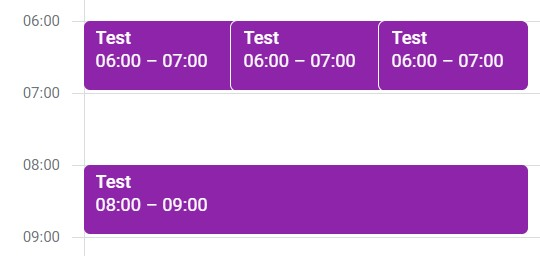
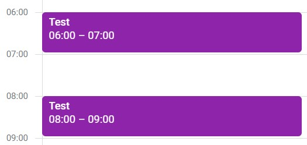

# Google Calendar Bulk Delete
Utility to bulk delete duplicate events from Google Calendar. I made it when an iOS phone app accidentally created 1000s of copies of the same event in my Google Calendar.

Before...



After...



It is based on this package, [gcsa](https://google-calendar-simple-api.readthedocs.io/en/latest/index.html).

You should follow the [Getting Started](https://google-calendar-simple-api.readthedocs.io/en/latest/getting_started.html) guide for advice on providing the program with access to the Google Calendar API for your calendar(s).

#### Installation
```commandline
pip install gcsa
```
The following global variables should be adjusted in `bulk_delete.py` to configure the program, 
```
CALENDAR_ID = 'youremail AT gmail.com'
START = (1/Jan/2023)[12:00]
TEST = False
```
Then run the program using `python bulk_delete.py`.

#### Caution
This program is potentially destructive, as it can delete events from your calendars. It is recommended to backup your calendar data before using it.
